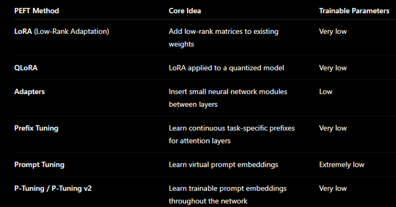
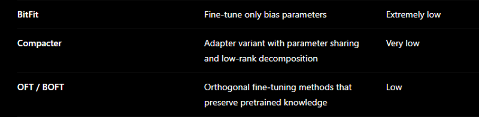

# Prompt fine-tuning 
* Prompt tuning is a technique for adapting a large language model (LLM) to a specific task by learning a small set of special input tokens (called a soft prompt) while keeping the model's original parameters frozen.
* Soft prompts are not textual prompts. They are added as vectors to the input. 
* It learns soft prompt which suitable for the task in hand. 
* It learns by concatenating prompts at the input before the input layer. It starts with random soft prompt and learns good prompt that suits the task in hand over epochs.
Prefix Tuning
* Prefix Tuning learns a small set of continuous �prefix vectors� that are prepended to the model�s internal attention mechanism at every layer. 
* In Prefix Tuning, the learned prefix is typically added to every Transformer layer, not just the input layer.
* Both prompt fine-tuning and pre-fix tuning learns soft prompt. In prompt fine-tuning the soft prompt is added to the input and in prefix-tuning the soft prompt is added to the attention layer. 
* In prefix tuning, the learned �prefix� is added inside every Transformer layer�s attention mechanism, not at the input text. Specifically, it is added to: Key (K) and Value (V) vectors in self-attention.

# Adapter 
* In machine learning, especially with large language models (LLMs), an adapter is a small set of additional neural network layers that are inserted into a pretrained model and trained for a specific task, while the original model's weights remain frozen.
* Instead of fine-tuning all billions of parameters in a model, adapters let you train only a tiny fraction of them:
o Full fine-tuning: Update every parameter.
o Adapter fine-tuning: Keep the original model unchanged and train only the adapter parameters.
* Adapter are basically inserted after every transformer layers. 
* Adapter modifies hidden state of some inputs. Hidden state is what have been learned so far after each layer. So adapter just add task related knowledge to the hidden states. 
* Adapter does not modify all the inputs. It just modifies only some task related inputs 
* Adapters add task-specific knowledge to the hidden states, allowing the model to adapt to new tasks without changing most of the original model parameters.
* Think of an adapter as a small correction module added to each transformer layer:
o h^'=h+"Adapter"(h)
o where h is the original hidden state and h^'is the updated hidden state. The adapter computes a small task-specific adjustment and adds it to the original representation while leaving the main model weights unchanged.
* When adapters are added, the original model parameters are frozen during training. The input still passes through the transformer layers, but only the adapter parameters are updated. The transformer weights remain unchanged.
o In other words, with adapters, the input passes through both the original transformer layers and the adapter layers. During training, the original model is frozen, and only the adapters are trained.
o 

MLP at the head of pretrained LLM models
* In a pretrained LLM, the MLP �at the head� (often called the output MLP / language modeling head / feed-forward head) plays a very specific role: it turns the model�s internal hidden representation into actual predictions over tokens.
* MLP takes vector embeddings from transformer encoder. The input is the final hidden state from the transformer stack.
* MLP does
o Expand the input it takes from encoder. It expands each token. As a result, features will be added to original dimension token which in turn expand the original input features. 
o Pass through activation function such as GELU, SwiGLU. 
o Linear projection: 
o Project or shrinking back to original dimension. The activation function will help to reduce the expanded vector into original dimension.

# LoRA fine-tuning
* LoRA fine-tuning stands for Low-Rank Adaptation fine-tuning. It�s a technique used to efficiently adapt large neural networks (like large language models) to new tasks without retraining the whole model.
*  Instead of updating all the original model weights, LoRA:
o Freezes the base model
o Adds small, trainable �adapter� matrices into certain layers (usually attention layers)
o Trains only these small matrices
* When we use LoRA for fine-tuning the library by itself add these low rank matrix automatically. 
* LoRA matrices are not attached per input token or per sample. They are attached to the model�s weight matrices, and they affect every input that passes through those layers.
* Take a linear layer: y=Wx
* With LoRA: y=Wx+B(Ax)
* So:
o The same LoRA matrices Aand Bare shared across all inputs 
o Every token embedding xthat enters that layer uses the same LoRA weights
* There are many types of LoRA
o Common architectural variants
* Attention-only LoRA
* Applied only to: Query (Q), Value (V)
* Used in most LLM fine-tuning setups
* Full attention LoRA
* Applied to: Q, K, V, and Output projections
* Higher quality, more parameters
* MLP/FFN LoRA
* Applied to feed-forward layers: up_proj, down_proj
* Useful for domain adaptation (e.g., coding, math)
* Hybrid LoRA
* Combination: Attention + MLP layers
* Better performance, slightly heavier

o Improved / advanced LoRA variants
* AdaLoRA (Adaptive LoRA)
* Instead of fixed rank r, it:
o dynamically allocates rank during training
o More efficient parameter usage
* Good when you don�t know optimal rank
* QLoRA
* Combines: Quantized base model (4-bit) and LoRA adapters on top
* Allows fine-tuning huge models on small GPUs
* Very popular (e.g., 65B models on a single GPU)
* LoRA+
* Improves optimization stability
* Uses different learning rates for A and B matrices
* DoRA (Weight-Decomposed LoRA)
* Splits weight update into: direction + magnitude
* Better accuracy than standard LoRA in many cases
* LoHa / LoKr (less common)
* Alternative decompositions:
o LoHa: Hadamard product-based adaptation
o LoKr: Kronecker factorization
* More experimental, sometimes better efficiency

